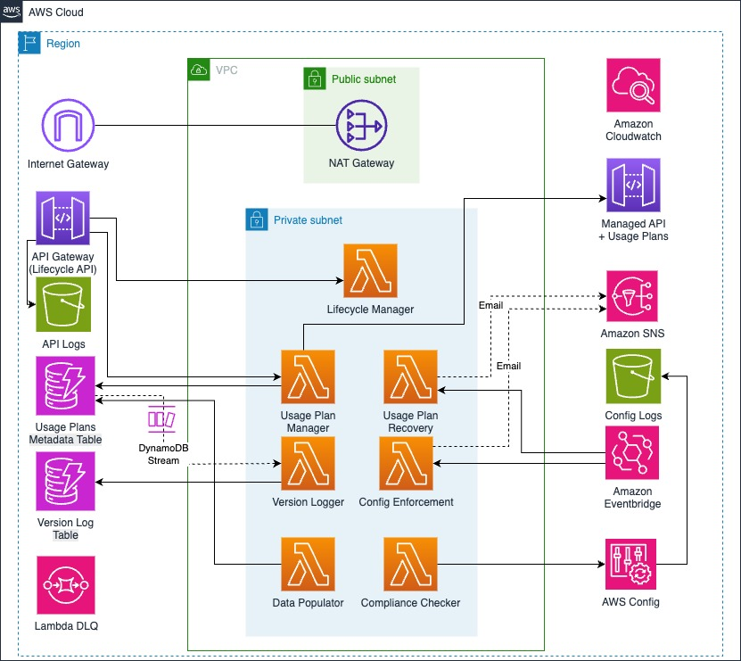

# AWS API Gateway Usage Plans Management System

## What this solution does

This system makes managing API Gateway usage plans simple and automatic. Think of it as your personal assistant that:

- **Watches your API plans** - Catches when someone changes settings they shouldn't
- **Keeps everything organized** - Stores all your plan details in one place
- **Protects your customers** - If a plan gets deleted by accident, it rebuilds it instantly
- **Sends you alerts** - Tells you when something needs your attention

Instead of manually checking dozens of usage plans across different APIs, this solution does the heavy lifting for you.

## Problems this solves

### 1. Someone changed your API settings
**What happens**: A team member changes rate limits in the AWS console, breaking your carefully planned API tiers.
**Why it's bad**: Your premium customers might get basic service, or your free users could overwhelm your servers.
**How we fix it**: The system notices the change immediately and alerts you. It can even fix simple problems automatically.

### 2. Too many plans to track
**What happens**: You have 50+ usage plans across different APIs, and you can't remember which is which.
**Why it's bad**: Plans get inconsistent settings, audits fail, and customers get confused about their service levels.
**How we fix it**: Everything gets stored in one central database with clear rules about what each plan should look like.

### 3. Retiring old plans safely
**What happens**: You want to stop offering an old API plan but don't want to break service for existing customers.
**Why it's bad**: Customers get angry when their service stops working, but keeping old plans forever creates security risks.
**How we fix it**: Mark plans as "deprecated" - existing customers keep working, but new signups are blocked.

## How it works

The system uses a **"Master Record"** approach where DynamoDB stores the correct settings for each usage plan:



**Simple flow**:
1. You create or update a usage plan through our API
2. The system saves the "correct" settings in DynamoDB
3. AWS Config constantly checks if API Gateway matches DynamoDB
4. If something doesn't match, you get an alert
5. The system can automatically fix common problems


## Core components

| Component | Purpose | Business value |
|-----------|---------|----------------|
| **DynamoDB Tables** | Stores governance metadata and immutable audit logs | Single source of truth, compliance audit trail |
| **Lambda Functions** | Executes business logic for CRUD operations and enforcement | Automated governance, cost optimization |
| **AWS Config Rules** | Continuously validates compliance between systems | Real-time drift detection, regulatory compliance |
| **EventBridge Events** | Triggers automated responses to configuration changes | Proactive issue resolution, reduced MTTR |
| **SNS Topics** | Delivers notifications for violations and lifecycle events | Immediate alerting, stakeholder communication |
| **API Gateway** | Provides REST endpoints for usage plan management | Developer self-service, integration capabilities |

## Use Cases & Business Scenarios

### Example 1: Creating API tiers for your business

**Your situation**: You run a weather API and want to offer Free, Basic, and Premium tiers with different limits.

**The old way**:
- Log into AWS console
- Manually create each usage plan
- Hope you remember the right settings
- No way to track who changed what

**The new way**:
```json
POST /usage-plans
{
  "name": "Premium Weather API",
  "tier": "Premium",
  "rate_limit": 200,
  "burst_limit": 400,
  "quota_limit": 100000,
  "quota_period": "MONTH",
  "description": "Premium tier with enhanced limits"
}
```

**What happens behind the scenes**:
1. Creates the usage plan in API Gateway
2. Saves the "master copy" of settings in DynamoDB
3. Starts monitoring for any unauthorized changes
4. Records who created it and when
5. Begins compliance checking

### Example 2: Retiring old plans

**Your situation**: You launched a "Beta API" plan last year, but now you want to move everyone to the new "Standard" plan.

**The challenge**: How do you stop new people from signing up for Beta without breaking service for existing Beta customers?

**The solution**:
```json
POST /lifecycle/beta-api-plan
{
  "action": "deprecate"
}
```

**What happens automatically**:
1. Marks the plan as "Deprecated" in the database
2. Existing customers keep their full access
3. New signup attempts get rejected
4. Your team gets notified about the change
5. Everything gets logged for audit purposes

### Example 3: Catching unauthorized changes

**Your situation**: Someone on your team goes into the AWS console and changes your Premium plan from 200 requests/second to 500 requests/second.

**Why this is bad**: Now Premium customers are getting Enterprise-level service for Premium prices, costing you money.

**How the system catches it**:
1. AWS Config notices the change within minutes
2. The system compares what's in API Gateway vs. what should be there
3. Finds the mismatch and logs it as a violation
4. Sends you an alert with details
5. Can automatically fix it if you want

**Alert you receive**:
```json
{
  "violation_type": "rate_limit_changed",
  "plan_name": "Premium Weather API",
  "should_be": 200,
  "actually_is": 500,
  "detected_at": "2024-01-15T14:30:00Z",
  "severity": "HIGH"
}
```


## How monitoring works

### The problem
People can change your API Gateway settings directly in the AWS console or through scripts. Without watching for these changes, you might not notice until customers complain or your bill spikes.

### The solution
AWS Config acts like a security guard, constantly checking if your API Gateway settings match what they should be according to your master records in DynamoDB.

### What gets checked

#### For API Stages
The system looks at each API stage and asks:
1. **What usage plan is this stage connected to right now?**
2. **What usage plan should it be connected to according to our records?**
3. **Do they match?**
   - **✅ Yes**: Everything is good
   - **❌ No**: Someone changed something they shouldn't have

#### For usage plans
For each usage plan, the system checks:
1. **Gets current settings** from API Gateway (rate limits, quotas, which APIs it's connected to)
2. **Gets correct settings** from DynamoDB (what we said it should be)
3. **Compares everything important**:
   - Rate limits (requests per second)
   - Burst limits (how many extra requests during spikes)
   - Quota limits (monthly caps)
   - Which API stages it's connected to
4. **Reports the results**:
   - **✅ Compliant**: Everything matches perfectly
   - **❌ Non-compliant**: Something is different from what it should be

### What settings are monitored

| What we Store | What we Check | Why it matters |
|---------------|---------------|----------------|
| `rate_limit` | Requests per second limit | Stops people from overwhelming your API |
| `burst_limit` | Spike handling capacity | Lets legitimate users have brief bursts of activity |
| `quota_limit` | Monthly usage cap | Controls costs and prevents abuse |
| `stages` | Which APIs this plan covers | Makes sure the right customers get the right service |

### Technical details

**Stage Identification**: Stages are tracked using complete ARN format to avoid naming conflicts:
```
arn:aws:apigateway:us-east-1::/restapis/abc123/stages/prod
```

### Common Issues and What Happens

**✅ Everything is Good**
- API Gateway settings match your master records
- All APIs are connected to the right usage plans
- Rate limits and quotas are exactly what you set

**❌ Something Changed**
- Someone changed rate limits in the AWS console
- APIs got connected to wrong usage plans
- Quota limits were modified without permission

**🔧 When Problems Are Found**
1. **You get notified immediately** via email/SMS
2. **Detailed logs** show exactly what's wrong
3. **AWS Config dashboard** shows all problems in one place
4. **Auto-fix available** for simple issues like wrong rate limits

## API Reference

### Usage Plan Operations
```
POST /usage-plans          # Create new usage plan with governance
GET  /usage-plans/{id}     # Retrieve plan details and metadata
PUT  /usage-plans/{id}     # Update plan (triggers compliance validation)
```

### Lifecycle Management
```
GET  /lifecycle/{id}       # Check current lifecycle state
POST /lifecycle/{id}       # Deprecate plan (blocks new signups)
```

### Monitoring
```
# Quota monitoring available through AWS CloudWatch
```

## Data structure

### Governance metadata schema
The DynamoDB table `usage-plans-metadata` stores the "source of truth" for each usage plan:

| Field | Purpose | Example |
|-------|---------|----------|
| `plan_id` | Unique identifier | `premium-api-v1` |
| `name` | Display name | `Premium API Access` |
| `tier` | Business tier | `Premium` |
| `rate_limit` | Max requests/second | `1000` |
| `burst_limit` | Spike capacity | `2000` |
| `quota_limit` | Monthly/daily cap | `1000000` |
| `lifecycle_state` | Current state | `Active` |
| `stages` | Associated API stages | `["arn:aws:apigateway:..."]` |
| `created_at` | Creation timestamp | `2024-01-15T10:30:00Z` |
| `deleted` | Deletion flag | `true` |
| `recreated_as` | New plan ID after recovery | `new-plan-id` |
| `recreated_from` | Original plan ID | `original-plan-id` |
| `deleted_at` | Deletion timestamp | `2024-01-15T14:30:00Z` |
| `recreated_at` | Recovery timestamp | `2024-01-15T14:31:00Z` |

## Plan lifecycle explained

| State | Meaning | Customer Impact | Actions Available |
|-------|---------------|-----------------|-------------------|
| **Active** | Normal operation | Full access, new signups allowed | Update, deprecate |
| **Deprecated** | Phasing out | Existing customers continue, no new signups | Archive only |

## Automated protection mechanisms

### Usage plan deletion recovery
The system automatically detects when a usage plan is deleted, recreates it with the same configuration, and updates references:

1. **Detection**: EventBridge rule monitors for `DeleteUsagePlan` API calls
2. **Initial Notification**: SNS alert sent with details of the deleted plan
3. **Metadata Retrieval**: System retrieves complete configuration from DynamoDB metadata table (not API Gateway)
4. **Recovery**: Lambda function recreates the usage plan with identical settings
5. **Stage Association**: All API stages from the original plan are re-associated using DynamoDB metadata
6. **Database Update**: DynamoDB records are updated to maintain the relationship between old and new IDs
7. **Final Notification**: Detailed SNS alert sent with recovery results

This protection ensures that even if a usage plan is accidentally deleted, service continuity is maintained with minimal disruption.

#### Recovery process details

```
Original Usage Plan (ID: abc123) → Deleted → New Usage Plan (ID: xyz789)
```

- The original DynamoDB record is marked as deleted but preserved for audit purposes
- A new record is created with the new ID and a reference to the original
- All settings (rate limits, quotas, API stage associations, API keys) are transferred to the new plan
- The system relies entirely on DynamoDB metadata for recovery, not API Gateway (which no longer has the deleted plan)
- Multiple stage formats in DynamoDB are supported to ensure complete recovery

## Getting started

### What you need first
```bash
# Check if you have these tools installed
aws --version        # AWS CLI (for deploying to AWS)
sam --version        # SAM CLI (for building the application)
python3 --version    # Python 3.11+ (for running tests)
```

### Deploy to your AWS account
```bash
# Build the application
sam build

# Deploy with guided setup (it will ask you questions)
sam deploy --guided

# Test that everything works
python3 test_api.py <YOUR_API_URL> <YOUR_STAGE_ARN>

# Real example:
python3 test_api.py https://abc123.execute-api.us-east-1.amazonaws.com/Stage arn:aws:apigateway:us-east-1::/restapis/xyz789/stages/prod
```

**What happens during deployment**:
- Creates DynamoDB tables for storing your usage plan settings
- Sets up Lambda functions for managing plans
- Creates AWS Config rules for monitoring
- Sets up SNS topics for alerts
- Creates sample usage plans you can test with immediately

### What alerts you will get

- **"Someone changed your API settings"**: When rate limits or quotas get modified
- **"Usage plan was deprecated"**: When a plan gets marked as no longer available
- **"Usage plan was deleted and recovered"**: When the system automatically fixes a deleted plan

### Monitoring Dashboard
- **Real-time status** of all your usage plans
- **History of changes** so you can see trends
- **Detailed reports** when something goes wrong, with suggestions on how to fix it

## Security and cost

### Security features
- All IAM roles use minimal required permissions
- Data encrypted at rest (DynamoDB) and in transit (SNS)
- API endpoints can be secured with API keys
- CloudWatch logs are encrypted
- DynamoDB tables protected from tampering outside of Lambda functions

### Cost Breakdown (US East-1 Pricing)

**Estimated Hourly Cost: $0.12 - $0.18 per hour**

| Service | Component | Hourly Cost | Monthly Cost | Notes |
|---------|-----------|-------------|--------------|-------|
| **Lambda** | 6 Functions (128MB each) | $0.000 - $0.002 | $0.00 - $1.50 | Pay per invocation, minimal idle cost |
| **DynamoDB** | 2 Tables (On-Demand) | $0.000 - $0.001 | $0.00 - $0.75 | Pay per read/write, no base cost |
| **API Gateway** | REST API with caching | $0.001 - $0.003 | $0.75 - $2.25 | $3.50 per million requests + cache |
| **VPC** | NAT Gateway | $0.045 | $32.85 | Fixed cost for internet access |
| **VPC** | Elastic IP | $0.005 | $3.65 | Fixed cost when attached to NAT |
| **S3** | 3 Buckets (Config + Logs) | $0.001 - $0.005 | $0.75 - $3.65 | Storage + requests |
| **KMS** | 4 Customer Keys | $0.004 | $3.00 | $1/month per key |
| **CloudWatch** | Logs + Metrics | $0.002 - $0.010 | $1.50 - $7.30 | Log ingestion + retention |
| **AWS Config** | Configuration Recording | $0.003 | $2.19 | $0.003 per configuration item |
| **SNS** | Notifications | $0.000 - $0.001 | $0.00 - $0.75 | Pay per message sent |
| **SQS** | Dead Letter Queue | $0.000 | $0.00 | Pay per message, minimal usage |
| **EventBridge** | Custom Rules | $0.000 - $0.001 | $0.00 - $0.75 | Pay per event matched |

**Fixed Monthly Costs**: ~$42 (NAT Gateway + EIP + KMS Keys)

**Variable Monthly Costs**: $0 - $15 (depends on API usage)

### Cost Optimization Features
- **DynamoDB On-Demand**: Pay only for actual reads/writes, no provisioned capacity
- **Lambda Reserved Concurrency**: Prevents runaway costs from unexpected traffic
- **API Gateway Caching**: Reduces backend Lambda invocations
- **CloudWatch Log Retention**: 90-day retention to control storage costs
- **S3 Lifecycle Policies**: Automatic transition to cheaper storage classes


**Cost monitoring**:
- AWS Cost Explorer shows daily breakdown by service
- CloudWatch billing alarms notify when costs exceed thresholds
- AWS Budgets can automatically stop resources if costs spike

## Troubleshooting guide

### "S3 Transfer Accelerator error"
In case the error: An error occurred (InvalidRequest) when calling the PutObject operation: S3 Transfer Acceleration is not configured on this bucket apply the next command on AWS CLI. <br>
```bash
aws configure set s3.use_accelerate_endpoint false
```

### "My Config Rule Shows Non-Compliant Resources"
1. Check CloudWatch logs for the specific violation details
2. Compare the actual API Gateway settings with your DynamoDB governance records
3. Verify stage ARNs are formatted correctly
4. Ensure all parameters match exactly between systems

### "A Usage Plan Was Deleted But Not Recreated"
1. Check CloudWatch logs for the `UsagePlanRecoveryFunction` Lambda function
2. Verify that the deleted plan had metadata in the DynamoDB table
3. Ensure the Lambda function has proper permissions to create usage plans
4. Check if the SNS notification about deletion was sent
5. Verify that stage information was properly stored in DynamoDB metadata
6. Check for errors in the stage association process


### "My Costs Are Higher Than Expected"
1. Check AWS Cost Explorer for the biggest cost drivers
2. Look for unexpected API Gateway traffic or Lambda invocations
3. Verify NAT Gateway data transfer charges
4. Check if DynamoDB is experiencing high read/write volumes

### "I Need More Detailed Logs"
Set this environment variable on your Lambda functions:
```bash
LOG_LEVEL=DEBUG
```

---

# Tutorial: Using the Management API

This tutorial shows you how to use the Management API to create, update, and manage your usage plans. All examples use real commands you can copy and paste.

## Step 1: Get your API URL

After deployment, SAM will show you the API URL. It looks like:
```
https://abc123def.execute-api.us-east-1.amazonaws.com/Stage
```

Save this URL - you'll use it in all the commands below.

## Step 2: Create your first usage plan

Let's create a "Basic" tier for your API:

```bash
curl -X POST https://YOUR_API_URL/usage-plans \
  -H "Content-Type: application/json" \
  -d '{
    "name": "Basic API Access",
    "description": "Basic tier for regular users",
    "tier": "Basic",
    "rate_limit": 100,
    "burst_limit": 200,
    "quota_limit": 10000,
    "quota_period": "MONTH"
  }'
```

**What this creates**:
- A usage plan that allows 100 requests per second
- Can handle bursts up to 200 requests per second
- Monthly limit of 10,000 requests
- Automatically gets monitored for changes

**Response you'll get**:
```json
{
  "plan_id": "basic-api-access-abc123",
  "name": "Basic API Access",
  "status": "created",
  "api_gateway_id": "def456ghi"
}
```

Save the `plan_id` - you'll need it for updates.

## Step 3: Connect your usage plan to an API

Now connect your usage plan to an actual API stage:

```bash
curl -X PUT https://YOUR_API_URL/usage-plans/basic-api-access-abc123 \
  -H "Content-Type: application/json" \
  -d '{
    "stages": [
      "arn:aws:apigateway:us-east-1::/restapis/YOUR_API_ID/stages/prod"
    ]
  }'
```

**How to find your stage ARN**:
1. Go to API Gateway in AWS Console
2. Click on your API
3. Click on "Stages"
4. The ARN format is: `arn:aws:apigateway:REGION::/restapis/API_ID/stages/STAGE_NAME`

## Step 4: Check your usage plan

Verify everything was created correctly:

```bash
curl -X GET https://YOUR_API_URL/usage-plans/basic-api-access-abc123
```

**Response shows**:
```json
{
  "plan_id": "basic-api-access-abc123",
  "name": "Basic API Access",
  "tier": "Basic",
  "rate_limit": 100,
  "burst_limit": 200,
  "quota_limit": 10000,
  "quota_period": "MONTH",
  "lifecycle_state": "Active",
  "stages": [
    "arn:aws:apigateway:us-east-1::/restapis/YOUR_API_ID/stages/prod"
  ],
  "created_at": "2024-01-15T10:30:00Z"
}
```

## Step 5: Create more tiers

Create a Premium tier with higher limits:

```bash
curl -X POST https://YOUR_API_URL/usage-plans \
  -H "Content-Type: application/json" \
  -d '{
    "name": "Premium API Access",
    "description": "Premium tier with enhanced limits",
    "tier": "Premium",
    "rate_limit": 500,
    "burst_limit": 1000,
    "quota_limit": 100000,
    "quota_period": "MONTH"
  }'
```

Create an Enterprise tier:

```bash
curl -X POST https://YOUR_API_URL/usage-plans \
  -H "Content-Type: application/json" \
  -d '{
    "name": "Enterprise API Access",
    "description": "Enterprise tier with maximum limits",
    "tier": "Enterprise",
    "rate_limit": 2000,
    "burst_limit": 5000,
    "quota_limit": 1000000,
    "quota_period": "MONTH"
  }'
```

## Step 6: Update a usage plan

Change the rate limit for your Basic plan:

```bash
curl -X PUT https://YOUR_API_URL/usage-plans/basic-api-access-abc123 \
  -H "Content-Type: application/json" \
  -d '{
    "rate_limit": 150,
    "burst_limit": 300
  }'
```

**What happens automatically**:
- Updates the usage plan in API Gateway
- Updates the master record in DynamoDB
- Triggers compliance validation
- Logs the change for audit purposes

## Step 7: Deprecate an old plan

Safely retire a plan without breaking existing customers:

```bash
curl -X POST https://YOUR_API_URL/lifecycle/basic-api-access-abc123 \
  -H "Content-Type: application/json" \
  -d '{
    "action": "deprecate"
  }'
```

**What this does**:
- Existing customers keep full access
- New signups get blocked
- Plan shows as "Deprecated" in the system
- You get notified about the change

## Step 8: Check lifecycle status

See the current state of any plan:

```bash
curl -X GET https://YOUR_API_URL/lifecycle/basic-api-access-abc123
```

**Response**:
```json
{
  "plan_id": "basic-api-access-abc123",
  "lifecycle_state": "Deprecated",
  "deprecated_at": "2024-01-15T15:45:00Z",
  "can_accept_new_customers": false,
  "existing_customers_affected": false
}
```

## Common API patterns

### List All Your Usage Plans
```bash
curl -X GET https://YOUR_API_URL/usage-plans
```

### Update Multiple Settings at Once
```bash
curl -X PUT https://YOUR_API_URL/usage-plans/PLAN_ID \
  -H "Content-Type: application/json" \
  -d '{
    "rate_limit": 200,
    "burst_limit": 400,
    "quota_limit": 50000,
    "description": "Updated limits for Q2"
  }'
```

### Connect One Plan to Multiple API Stages
```bash
curl -X PUT https://YOUR_API_URL/usage-plans/PLAN_ID \
  -H "Content-Type: application/json" \
  -d '{
    "stages": [
      "arn:aws:apigateway:us-east-1::/restapis/API1/stages/prod",
      "arn:aws:apigateway:us-east-1::/restapis/API2/stages/prod",
      "arn:aws:apigateway:us-east-1::/restapis/API3/stages/prod"
    ]
  }'
```

## Testing configuration drift

To see the monitoring in action:

1. **Create a usage plan** using the API above
2. **Go to AWS Console** → API Gateway → Usage Plans
3. **Manually change** the rate limit in the console
4. **Wait 5-10 minutes** for AWS Config to detect the change
5. **Check your email/SMS** for the compliance alert
6. **Look at AWS Config** dashboard to see the violation

This shows how the system protects against unauthorized changes.

## Error Handling

### Invalid Rate Limit
```bash
# This will fail - rate limit too high
curl -X POST https://YOUR_API_URL/usage-plans \
  -d '{"rate_limit": 999999}'

# Response:
{
  "error": "rate_limit exceeds maximum allowed value",
  "max_allowed": 10000
}
```

### Plan Not Found
```bash
# This will fail - plan doesn't exist
curl -X GET https://YOUR_API_URL/usage-plans/nonexistent-plan

# Response:
{
  "error": "Usage plan not found",
  "plan_id": "nonexistent-plan"
}
```

### Invalid Stage ARN
```bash
# This will fail - malformed ARN
curl -X PUT https://YOUR_API_URL/usage-plans/PLAN_ID \
  -d '{"stages": ["invalid-arn"]}'

# Response:
{
  "error": "Invalid stage ARN format",
  "expected_format": "arn:aws:apigateway:region::/restapis/api-id/stages/stage-name"
}
```

## Next Steps

1. **Set up monitoring alerts** - Configure SNS to send notifications to your team
2. **Create your tier structure** - Define Basic, Premium, Enterprise plans that match your business
3. **Test the compliance checking** - Make manual changes in AWS Console to see alerts
4. **Integrate with your signup flow** - Use the API to automatically assign customers to appropriate tiers
5. **Set up automated responses** - Configure Lambda functions to auto-fix common drift issues

### Cost-Saving tips

**For Light Usage** (< 100K API calls/month):
- Consider using public subnets for Lambda to eliminate NAT Gateway costs
- Use AWS managed KMS keys instead of customer managed keys

**For Heavy Usage** (> 1M API calls/month):
- Enable API Gateway caching to reduce Lambda invocations
- Monitor Lambda memory usage and optimize allocation
- Consider Reserved Capacity for DynamoDB if usage is predictable

---

# Cleanup Scripts

When you're done testing or want to remove the system completely, use these cleanup scripts to avoid ongoing charges.

## Complete solution cleanup

The `complete-cleanup.sh` script removes everything the system created:

```bash
# Basic cleanup (keeps protected resources)
./complete-cleanup.sh

# Complete cleanup including protected DynamoDB tables
./complete-cleanup.sh --delete-protected

# Cleanup with specific AWS profile
./complete-cleanup.sh --profile my-aws-profile

# Cleanup across multiple regions
./complete-cleanup.sh --regions us-east-1,eu-west-1

# Cleanup across all AWS regions
./complete-cleanup.sh --all-regions
```

**What it does**:
1. **Detaches Lambda functions** from VPCs to prevent deletion issues
2. **Cleans up network interfaces** that might block VPC deletion
3. **Empties and deletes S3 buckets** (access logs, config buckets)
4. **Removes DynamoDB tables** (if `--delete-protected` is used)
5. **Deletes the CloudFormation stack** using SAM
6. **Cleans up any remaining usage plans** in API Gateway

## Usage plans only cleanup

The `usage_plan_cleanup.sh` script only removes API Gateway usage plans and API keys:

```bash
# See what would be deleted (dry run)
./usage_plan_cleanup.sh

# Actually delete usage plans and API keys
./usage_plan_cleanup.sh --confirm

# Check which API stages are attached to usage plans
./usage_plan_cleanup.sh --check-stages

# Remove stage associations without deleting plans
./usage_plan_cleanup.sh --remove-stages

# Cleanup across specific regions
./usage_plan_cleanup.sh --confirm --regions us-east-1,eu-west-1
```

**What it does**:
- Lists all usage plans and API keys in your account
- Shows which API stages are connected to each plan
- Removes API key associations from usage plans
- Removes stage associations from usage plans
- Deletes the usage plans and API keys

## When to Use Each Script

### Use `complete-cleanup.sh` when:
- You want to completely remove the system
- You're done testing and want to stop all charges
- You need to redeploy from scratch
- You want to clean up across multiple regions

### Use `usage_plan_cleanup.sh` when:
- You only want to clean up usage plans, not the infrastructure
- You want to start fresh with usage plans but keep the system running
- You need to check or modify stage associations
- You're troubleshooting usage plan issues

## Safety Features

**Dry Run Mode**: Both scripts show what they'll delete before actually doing it
```bash
# See what would be deleted without actually deleting
./complete-cleanup.sh
./usage_plan_cleanup.sh
```

**Protected Resources**: The complete cleanup script preserves important data by default
```bash
# Only deletes infrastructure, keeps DynamoDB tables with your data
./complete-cleanup.sh

# Deletes everything including your usage plan data
./complete-cleanup.sh --delete-protected
```

**Multi-Region Support**: Both scripts can clean up across multiple AWS regions
```bash
# Clean up specific regions
./complete-cleanup.sh --regions us-east-1,eu-west-1,ap-southeast-1

# Clean up all regions where you have resources
./complete-cleanup.sh --all-regions
```

## Cost Impact of cleanup

After running `complete-cleanup.sh`, your monthly costs drop to **$0**:
- ✅ NAT Gateway deleted (saves $32.85/month)
- ✅ Elastic IP released (saves $3.65/month)
- ✅ KMS keys deleted (saves $12/month)
- ✅ Lambda functions deleted (saves $0-1.50/month)
- ✅ DynamoDB tables deleted (saves $0-0.75/month)
- ✅ All other resources removed

After running `usage_plan_cleanup.sh` only, infrastructure costs continue but you stop any usage-based charges from API calls.

## Troubleshooting cleanup

### "VPC deletion failed"
```bash
# The complete cleanup script handles this automatically by:
# 1. Detaching Lambda functions from VPCs first
# 2. Cleaning up network interfaces
# 3. Then deleting the VPC through CloudFormation
```

### "S3 bucket not empty"
```bash
# The script empties buckets before deleting them
# If it fails, manually empty the bucket:
aws s3 rm s3://your-bucket-name --recursive
aws s3 rb s3://your-bucket-name
```

### "DynamoDB table has deletion protection"
```bash
# Use the --delete-protected flag:
./complete-cleanup.sh --delete-protected
```

### "Usage plans still exist after cleanup"
```bash
# Run the usage plan cleanup separately:
./usage_plan_cleanup.sh --confirm --all-regions
```

These cleanup scripts ensure you can easily remove the system when you're done testing, preventing unexpected AWS charges.

## ⚠️ PRODUCTION ENVIRONMENT WARNING ⚠️

**DO NOT USE CLEANUP SCRIPTS IN PRODUCTION ENVIRONMENTS**

These cleanup scripts are designed for **DEVELOPMENT AND TESTING ONLY**. Running them in production will:

- **Delete ALL usage plans** across your AWS account
- **Remove ALL API keys** and their associations
- **Destroy customer access** to your APIs immediately
- **Delete audit logs** and compliance history
- **Remove monitoring infrastructure** without warning
- **Cause service outages** for all API consumers

**Before running ANY cleanup script:**
1. Verify you're in a development/test AWS account
2. Confirm no production traffic is using the APIs
3. Back up any important usage plan configurations
4. Notify your team about the planned cleanup
5. Use `--dry-run` mode first to see what will be deleted

**For production environments:**
- Use the Management API to deprecate plans gradually
- Follow proper change management procedures
- Test changes in development first
- Consider blue/green deployment strategies
- Maintain proper backup and rollback procedures

**Remember: These scripts will delete resources across ALL regions if you use `--all-regions`. Always double-check your AWS account and region before running.**

## Security

See [CONTRIBUTING](CONTRIBUTING.md#security-issue-notifications) for more information.

## License

This library is licensed under the MIT-0 License. See the LICENSE file.